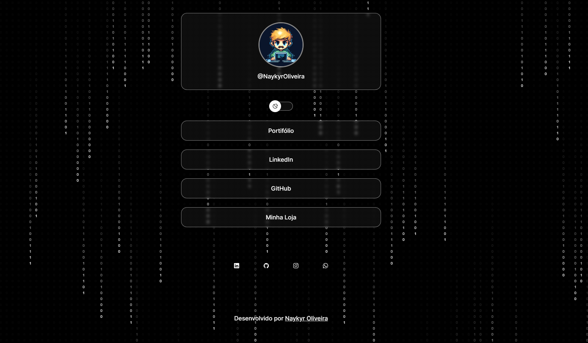

<h1 align="center"> <a href="https://social-links-xi-brown.vercel.app/" target="_blank">SocialLinks</a> </h1>

  <a href="#-tecnologias">Tecnologias</a>&nbsp;&nbsp;&nbsp;|&nbsp;&nbsp;&nbsp;
  <a href="#-projeto">Projeto</a>&nbsp;&nbsp;&nbsp;|&nbsp;&nbsp;&nbsp;
  <a href="#memo-licença">Licença</a>

  

 

  

## 🚀 Tecnologias

Esse projeto foi desenvolvido com as seguintes tecnologias:

- HTML e CSS
- JavaScript
- Git e Github
- Figma

## 💻 Projeto

SocialLinks é um agregador de links que me permite centralizar todos os meus links importantes em uma única página. Semelhante ao Linktree, este projeto foi criado para permitir que eu compartilhe todos os meus conteúdos por meio de uma única URL

## :memo: Licença

Esse projeto está sob a licença MIT.